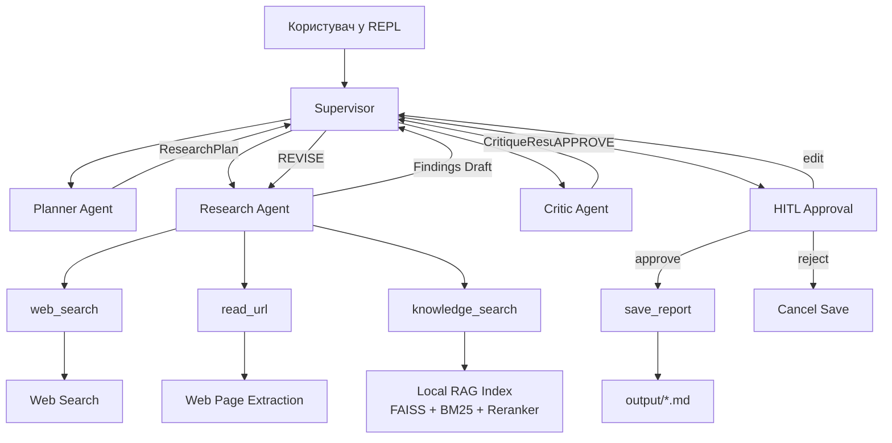

# HT Lektion 8 — Мультиагентна дослідницька система

Мультиагентний research-assistant, побудований на базі **LangChain**, **LangGraph**, **OpenAI** та **гібридного RAG**.  
Система вміє планувати дослідження, збирати факти з локальної бази знань і вебджерел, критикувати власну відповідь та **просити підтвердження користувача перед збереженням фінального звіту**.

---

## ✨ Основні можливості

- **Supervisor-based orchestration**
- Окремі ролі агентів:
  - `Planner` — будує структурований план дослідження
  - `Researcher` — збирає та узагальнює факти
  - `Critic` — перевіряє якість результату та за потреби просить доопрацювання
- **Hybrid RAG**:
  - `FAISS` semantic search
  - `BM25` lexical search
  - `CrossEncoder` reranking
- **Human-in-the-Loop (HITL)** перед `save_report`
- **Структуровані відповіді** через Pydantic:
  - `ResearchPlan`
  - `CritiqueResult`
- **Захисні обмеження**:
  - максимум циклів ревізії
  - recursion limit для графа
  - timeout / retry для LLM
  - валідація URL перед читанням сторінок
- Автоматичний **Windows-safe fallback** для FAISS при OneDrive / не-ASCII шляхах

---

## 🧠 Архітектура



---

## 🔄 Як працює система

1. Користувач вводить запит у CLI.
2. `Supervisor` передає задачу агенту `Planner`.
3. `Planner` повертає структурований план дослідження.
4. `Researcher` використовує:
   - `web_search`
   - `read_url`
   - `knowledge_search`
5. `Critic` перевіряє, чи результат:
   - достатньо повний,
   - достатньо актуальний,
   - добре структурований.
6. Якщо потрібно — запускається ще один цикл доопрацювання.
7. Перед записом у файл система зупиняється й питає користувача:
   - `approve`
   - `edit`
   - `reject`

Якщо ліміт ревізій вичерпано, система все одно може згенерувати **best-effort draft** із поміткою-дисклеймером.

---

## 🗂️ Структура проєкту

```text
HT Lektion 8/
├── agents/
│   ├── __init__.py
│   ├── planner.py
│   ├── research.py
│   └── critic.py
├── data/
├── index/
├── output/
├── .env.example
├── config.py
├── ingest.py
├── main.py
├── requirements.txt
├── retriever.py
├── schemas.py
├── supervisor.py
└── tools.py
```

---

## 🧩 Відповідальність агентів

| Агент | Роль | Вихід |
|---|---|---|
| `Planner` | Формує план дослідження | `ResearchPlan` |
| `Researcher` | Збирає та синтезує факти | чернетка висновків |
| `Critic` | Оцінює якість і вирішує `APPROVE` / `REVISE` | `CritiqueResult` |
| `Supervisor` | Керує маршрутом виконання та tool-calls | фінальний контроль потоку |

---

## 🛠️ Технології

| Шар | Інструменти |
|---|---|
| Оркестрація агентів | `langchain`, `langgraph` |
| LLM | `ChatOpenAI` |
| Структурований вивід | `pydantic` |
| Retrieval | `FAISS`, `rank_bm25` |
| Reranking | `sentence-transformers` (`CrossEncoder`) |
| Web tools | `ddgs`, `trafilatura` |
| Обробка PDF | `pypdf` |

---

## ⚙️ Налаштування

### 1) Встановіть залежності

```bash
python -m venv .venv
.venv\Scripts\activate
pip install -r requirements.txt
```

### 2) Створіть `.env`

Скопіюйте `.env.example` у `.env` та вкажіть свій ключ:

```env
openai_api_key=sk-your-real-key-here
model_name=gpt-4o
```

Корисні дефолтні параметри вже задані в `.env.example`:

- `critique_max_rounds=2`
- `graph_recursion_limit=25`
- `llm_timeout_sec=90`
- `url_fetch_timeout_sec=10`

### 3) Побудуйте локальний індекс знань

```bash
python ingest.py
```

### 4) Запустіть систему

```bash
python main.py
```

---

## 💬 Поведінка CLI

Під час запуску застосунок:

- перевіряє, чи існує knowledge index,
- при потребі запускає `ingest()`,
- прогріває RAG retriever,
- стартує REPL-сесію.

Доступні команди:

- `debug on` — увімкнути детальне трасування `Plan -> Research -> Critique`
- `debug off` — вимкнути технічні логи
- `exit` / `quit` — вийти з програми
- `/ingest` — перебудувати індекс

Перед збереженням звіту система покаже паузу та попросить рішення:

```text
approve / edit / reject
```

---

## 🧪 Приклад запиту

```text
Порівняй Naive RAG, Agentic RAG і Corrective RAG на основі матеріалів курсу та актуальних вебджерел.
```

Очікуваний сценарій:

- `Planner` створює план,
- `Researcher` збирає дані,
- `Critic` оцінює якість,
- якщо результат достатній — спрацьовує HITL-підтвердження,
- звіт зберігається в `output/`.

---

## 🔒 Надійність і безпека

У проєкті реалізовано:

- **hard revise limit** через `critique_max_rounds`
- **graph recursion limit**
- **LLM timeout / retry policy**
- **валідацію URL** перед читанням сторінок
- **HITL approval** перед записом у файл
- **fallback-логіку** на випадок неідеального structured output від `Critic`

---

## 🪟 Примітка для Windows

На Windows, особливо при використанні **OneDrive** або директорій із **кирилицею / не-ASCII символами**, FAISS іноді не може зберегти `index.faiss`.

Щоб уникнути цієї проблеми, проєкт автоматично переносить FAISS binary index у безпечний шлях у `LOCALAPPDATA`, якщо стандартний шлях ризикований.

---

## 📌 Що демонструє це домашнє завдання

Цей проєкт демонструє:

- **multi-agent orchestration**,
- **agent-as-tool design**,
- **structured outputs**,
- **Evaluator–Optimizer loop**,
- **RAG + web augmentation**,
- **Human-in-the-Loop approval flow**.

  ## ⚙️ Troubleshooting

- Якщо агент зависає або довго відповідає:
  - збільшіть `llm_timeout_sec` у `.env` (дефолт: 90 с)
  - збільшіть `url_fetch_timeout_sec` (дефолт: 10 с)
- Якщо після зависання наступний запит видає `Error: tool_calls must be followed by tool messages`:
  - система автоматично відкриває новий thread і повідомляє про це — просто повторіть запит
- Якщо відповідь обривається або містить мало даних:
  - збільшіть `max_url_content_length` у `.env` (дефолт: 3000)
  - збільшіть `max_search_results` (дефолт: 4)
- Якщо не знаходить локальні документи:
  - перевірте вміст `data/`
  - запустіть `python ingest.py` ще раз
- Якщо цикл ревізій завершується занадто рано:
  - збільшіть `critique_max_rounds` у `.env` (дефолт: 2)

## Зверніть увагу!
Пам'ять зберігається в межах сеансу через спільний `thread_id`. При зависанні система автоматично створює новий thread з чистим станом.

## Ліцензія
Навчальний проєкт. Використовуйте та адаптуйте під свої задачі.
